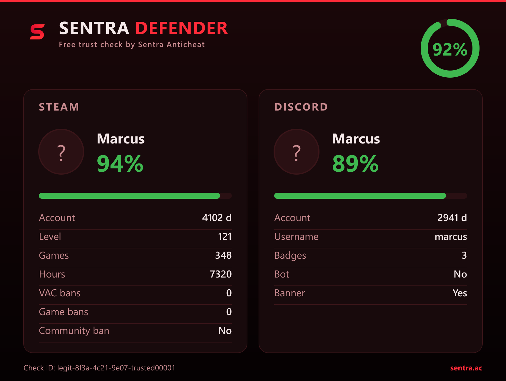
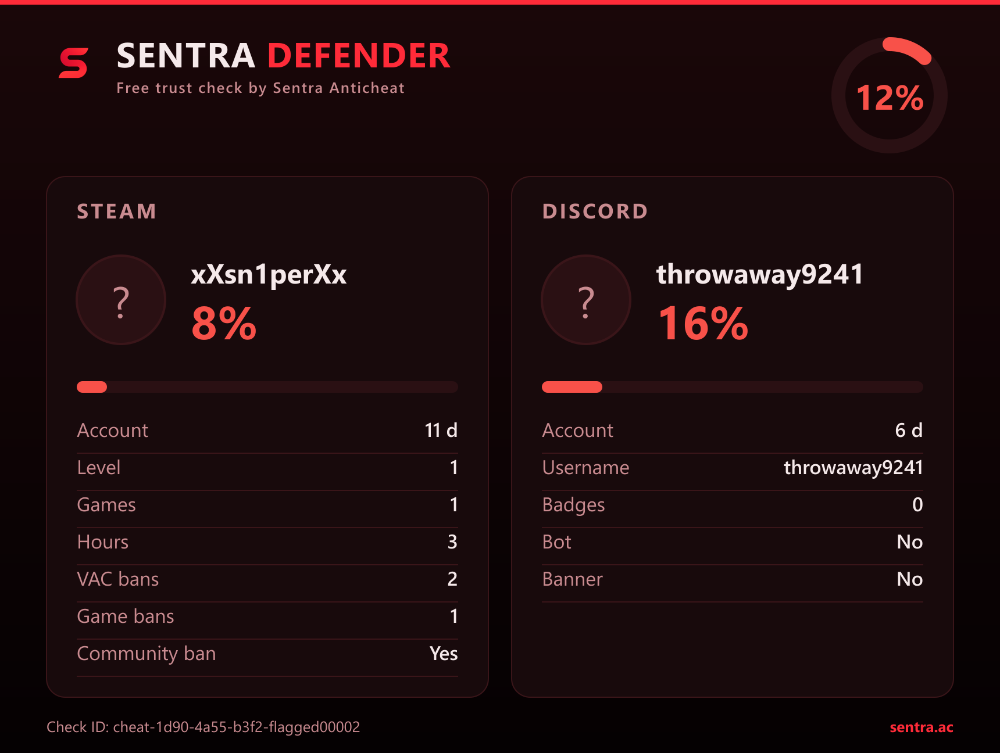

<div align="center">


# Sentra Defender

### Free player trust checks for your FiveM server — powered by [Sentra Anticheat](https://sentra.ac)

Instantly know **who's connecting** to your server. Sentra Defender scores every
player the moment they join and sends a clean report straight to your Discord.

[](https://sentra.ac)
[](https://sentra.ac)
[](#license)

<br />

<table>
<tr>
<td align="center"><b>✅ Trusted player</b></td>
<td align="center"><b>🚫 Flagged cheater</b></td>
</tr>
<tr>
<td></td>
<td></td>
</tr>
</table>

</div>

---

## ✨ Why Sentra Defender?

Fake accounts, ban-evaders and throwaway profiles are a constant headache. Sentra
Defender gives your staff an instant, at-a-glance **trust score** for every player
who joins — so you can act *before* problems start.

- 🛡️ **Automatic** — every player is scored the moment they join. Zero staff effort.
- ⚡ **Fast** — a single API call returns a trust score in milliseconds.
- 🖼️ **Beautiful reports** — a branded card is delivered to your Discord webhook.
- 🔌 **Plug & play** — drop the resource in, add your key, done.
- 🧩 **Developer-friendly** — a simple export lets any resource read a player's trust.
- 💸 **100% free** — grab your API key at [sentra.ac](https://sentra.ac).

---

## 🚀 Quick start

### 1. Get your free API key

Create a free account at **[sentra.ac](https://sentra.ac)** and copy your API key.

### 2. Install the FiveM resource

```bash
# Drop the resource into your server's resources folder
resources/
└── sentra-defender/
    ├── fxmanifest.lua
    ├── config.lua
    └── server.lua
```

Add it to your `server.cfg`:

```cfg
ensure sentra-defender
```

### 3. Configure

Open `sentra-defender/config.lua`:

```lua
Config = {
    -- Your API key. Create a free one at https://sentra.ac
    ApiKey = 'your-key-here',

    -- Discord webhook where reports are posted.
    Webhook = 'https://discord.com/api/webhooks/...',

    -- Only report players whose trust is BELOW this value (0-100).
    --   100 = report everyone   ·   0 = report no one
    MinTrust = 50,
}
```

That's it. The resource refuses to start until your key and webhook are set — no
silent misconfiguration.

---

## 🎯 How it works

```
 Player joins  ──▶  Sentra Defender  ──▶  Sentra API  ──▶  Trust score
                                                       └──▶  Discord report
```

Every connecting player is scored automatically. Suspicious players (below your
`MinTrust` threshold) are flagged in your Discord with a full report card. The
scoring model is handled entirely by Sentra — you just get the result.

---

## 🧩 Developer export

Any other resource can read a player's cached trust score — no extra API calls:

```lua
local trust = exports['sentra-defender']:GetTrust(playerId)

if trust and trust < 40 then
    -- e.g. restrict access, flag for review, notify staff...
end
```

---

## 🖼️ Report preview

<div align="center">

| ✅ Trusted player | 🚫 Flagged cheater |
|:---:|:---:|
|  |  |

</div>

---

## 💬 Support

Questions, ideas or issues? Visit **[sentra.ac](https://sentra.ac)** or open an issue here.

---

## License

Sentra Defender is a **free product of [Sentra Anticheat](https://sentra.ac)**.
Use it, share it, protect your server. ❤️

<div align="center">
<sub>Built by <b>Sentra Anticheat</b> · <a href="https://sentra.ac">sentra.ac</a></sub>
</div>
